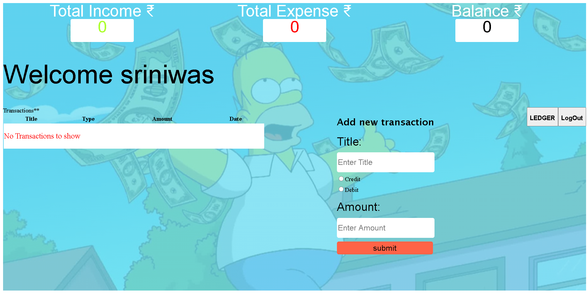
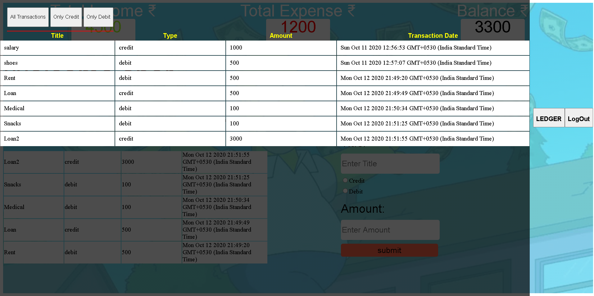

## Expense Manager

>A simple website to handle users Expense and displays according to the user's choice.
<<All transactions//Credits//Debits>>

##  <a href="https://lsriniwas.github.io/module_3_collab/">Project Link</a>
 

## Built With

- HTML and CSS.
- Javascript
- Font awesome and Google Font.
